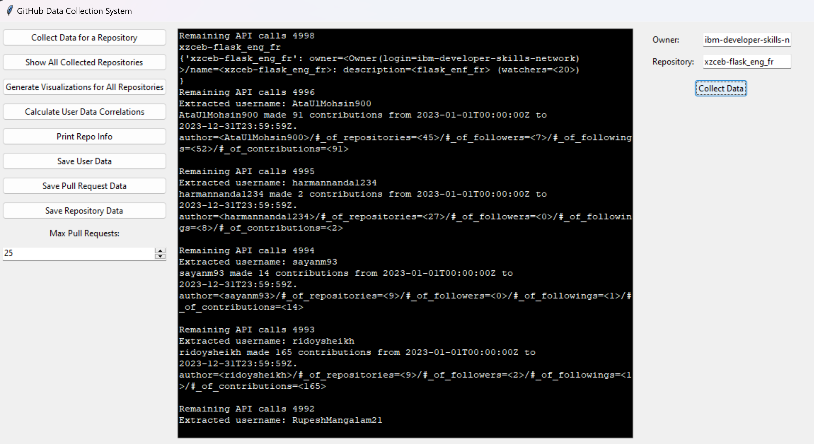
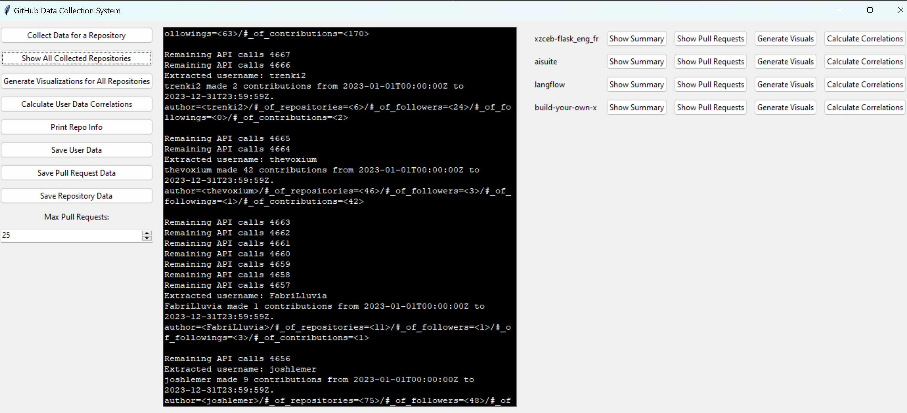
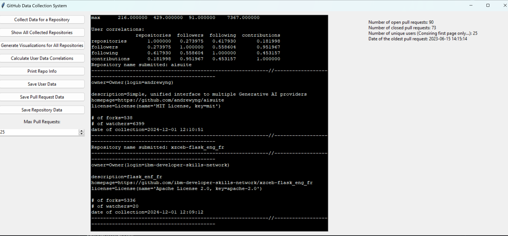
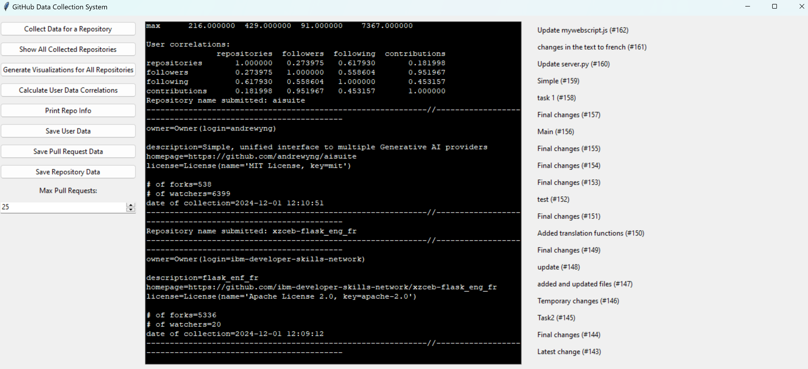
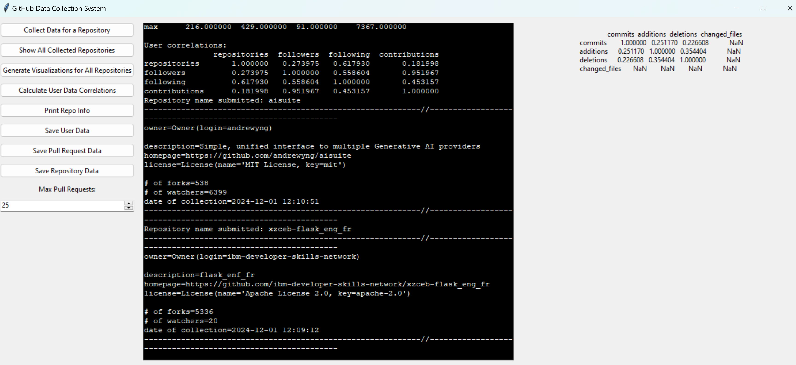
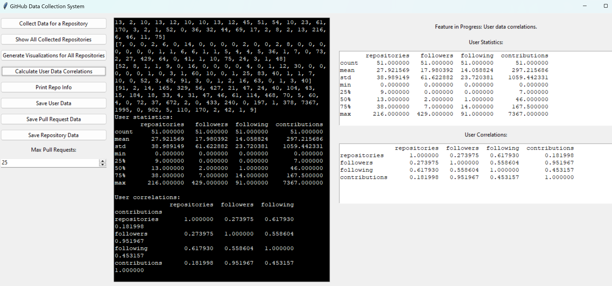
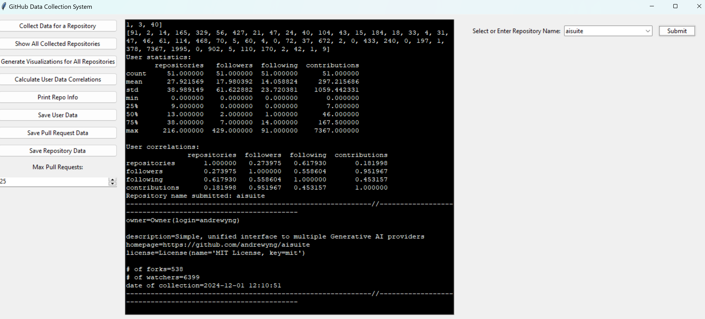

# github_rest_api_scrape

## Requirements

### Unit Testing

At least 5 unit tests are required to ensure proper execution of the program.

### Object-Oriented Programming

Code should be structured using Object-Oriented Programming to collect and analyze data.

### Repository Information

Collected repository information should include:

    Repository Name
    Owner
    Description
    Homepage
    License
    Number of Forks
    Watchers
    Date of Collection

Repository information should also have ability to be printed to the user during execution

#### Pull Request Information

During repository collection, information on each pull request should also be collected, including:

    Title
    Number
    Body
    State
    Date of Creation
    Closing Date
    User
    Number of Commits
    Number of Additions
    Number of Deletions
    Changed Files

#### Profile Information

For each author found when collecting pull request information, the following information should be collected from the author:

    Number of Repositories
    Number of Followers
    Number of Following
    Number of Contributions in the last year

### Saving Information

Any object (repository, pull request, author) should be converted into a CSV entry without duplicates.

#### Repository Information

Repository information should be saved to a CSV called 'repositories.csv'.

#### Pull Request Information

Pull request information should be saved in a file named after the owner and repository name.

#### Author Information

User information should be saved to a CSV called 'users.csv'.

### Menu

A console or GUI menu should be available for users, which will allow users to do the following:

#### Collect Information

Users can request the program to collect data for a specific repository from GitHub, providing the program with the owner and repository name.  The program will then collect the following information from the repository:

    Repository Information
    Pull Request Information
    User Information

#### Display Collected Information

Upon prompt from the user, the program will be able to:

Show all repositories collected.

Show all pull requests from a repository.

Show a summary of a repository, which will contain:

    Number of open pull requests
    Number of closed pull requests
    Number of Users
    Date of the oldest pull request

Create visual representations of repository data, which includes:

    A boxplot comparing closed/open pull requests by number of commits
    A boxplot comparing closed/open pull requests by number of additions/deletions
    A boxplot comparing the number of changed files grouped by author association
    A scatterplot showing the relationship between additions and deletions

#### Visualize Information

The program will be able to create visual representations of the data collected, which includes:

    A line graph showing the total number of pull requests per day
    A line graph comparing the number of open/closed pull requests per day
    A bar plot comparing the number of users per repository

## Source Code Overview

In our project, we have two Python files for implementing our solutions, and a python file for unit testing.

#### repos_module.py

This file is responsible for collecting all necessary information from Github, including repository information, pull request information, and user profile information, as well as the ability to save the repository information to a .csv file.

    Author Class: Stores information on a repository's author, including name, number of public repositories, number of followers/following, and number of contributions.  Also can generate a string representation of the object.

    Authors Class: Stores information of multiple authors.  Includes a dictionary of all authors added to the class, an add_author method to add an author to the object.

    Owner Class: Stores login information for use of GitHub REST API.

    License Class: Stores license information for a github repository.

    Pull Request Class: Stores pull request information, including user, body, title, state, number, number of commits, number of additions/deletions, closed dates if applicable, time of creation, and files changes.  Also can generate a string representation of the object.

    Pull Requests Class: Stores multiple pull requests in a single object.  Can create a string representation of the object, and calculates daily open/closed counts for applicable pull requests stored in the object.

    GitHubRepository Class: Stores information about a github repository, including url, token, headers, date of collection, number of pulls, number of open issues, name, number of forks, owner, license, number of watchers, and description.  Also contains methods for creating an api url, fetching repo and pull request data, and can generate a string representation of the object.

    Repos class: Stores information of all repositories collected.  Also contains methods for saving repository data to a .csv file, saving pull request information to a .csv file, saving user data information to a .csv file, as well as printing repository information.

#### git_scrape_gui.py

This file is responsible for the user interface element of our project, giving the user access to use the GitHub REST API to collect repository information, print and/or save collected repository information, as well as create data visualizations of collected repository and pull request information.

#### unit_testing.py

This file does not contain solutions to the listed requirements, but instead contains a test suite for ensuring that the program runs as intended by checking for correct object instances, API rate limits, and number of arguments for collecting information such as pull request, author, and repository information.

### Example Outputs

#### Collecting Repositories

#### Listing Collected Repositories + Repository-Specific Options

##### Collected Repositories Submenu - Show Summary

##### Collected Repositories Submenu - Show Pull Requests

##### Collected Repositories Submenu - Show User Correlations

#### Calculating User Correlations

#### Print Repository Information

## System Usage
* Running the Code
    - To run the program, simply execute the git_scrape_gui.py file either from the console or from your preferred IDE.
    
* Layout
    - On the right side of the menu is a list of options that can be employed in the collection and analysis of repository data.
    - Central to the screen is the command terminal through which you can see outputs from the data collection/analysis process
    - The right side of the screen is where submenus and data will appear when contextually relevant.

* Collecting Repository Information
    - Pressing the "Collect Data for a Repository" button will open a submenu on the right side of the command window.
    - Two fields are presented, "Owner" and "Repository'. These fields expect the repository owner and the name of the repository respectively. If either field is populated improperly data collection will fail to be collected.
    - This system facilitates multiple repository collection. Once collection for one repository concludes, a popup will appear informing you. At this time, you may input the owner and name of additional repositories and collect data for all of them.
    - Occasionally, the system will be rate limited, at which point it will begin to fail in collecting the specific author information for a repository. When this occurs, the system will begin attempting to retry data collection at regular intervals until 5 attempts have been made, at which point the system will stop making attempts for that author. This is expected behavior, and result of collecting such granular data at a rapid pace. Often, this results in the loss of one or two authors, but the majority are collected successfully as a result of the collection delay.

* Show All Collected Repositories
    - This option pulls up a submenu that lists all the repositories for which data has been collected. Each repository has a series of options for producing data specific to that repository.
    - Show Summary Sub-Option: This option will print a summary of the repository to the console.
    - Show Pull Requests Sub-Option: This option will print a list of the first 25 currently open pull requests on the right of the console.
    - Generate Visuals Sub-Option: This option will generate a series of graphs related to the repository and store them in the same folder as the source code. Graph filenames will take the form "<repository_name>_<graph_type>.png" 
    - Calculate Correlations Sub-Option: This option will generate correlations between contributors to the repository and display on the right side of the console. 

* Generate Visuals for All Repositories
    - Choosing this will generate relevant graphs for all the currently collected repositories. These files will be stored in the same directory as the source code and take the form "<repository_name>_<graph_type>.png"

* Calculate User Data Correlations
    - This option will calculate correlations between user data for each collected repository and display them to the user on the right side of the screen.

* Print Repo Info
    - Selecting this option pulls up a dropdown menu on the right side of the screen from which you can select a repository and print the information about it to the console.

* Save User Data
    - Selecting this option will pull up a dropdown menu on the right side of the screen from which you can select a user from amongst all the users and write their data to a CSV file. All the user data will be collated into a singular file, so you can select as many users as you'd like and all their data will be written to the same file.

* Save Pull Request Data
    - Selecting this option will pull up a dropdown menu on the right side of the screen from which you can select a repository from amongst all the repositories and write it's data to a CSV file in the "/repos" directory.

* Save Repository Data
    - Selecting this option will pull up a dropdown menu on the right side of the screen from which you can select a repository from amongst all the repositories and write it's data to a global CSV called "repositories.csv" that will be stored in the same directory as the source code. You can write subsequent repository information to this CSV similar to the User Data.

* Max Pull Requests
    - You can adjust the amount of collected pull requests for each repository by increasing/decreasing this value.
